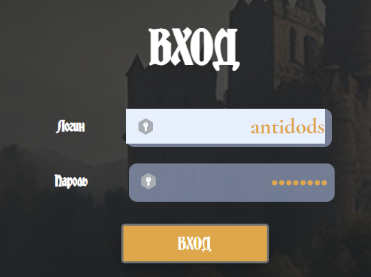

# Bug Report
***
Давайте начнём вести простенький баг репорт, формат ведения предлагаю обсудить.
***

## Незначительные S1
* При использовании автозаполнения поле ввода отображается некорректно 
* При выходе из профиля не происходит удаление юзера из стора, соответственно можно зайти в профиль и т.д.
## Серьезные S2
* На странице изменения аватара, при загрузке файла появляется кнопка удалить, но при нажатии ничего не происходит.
## Критический S3

